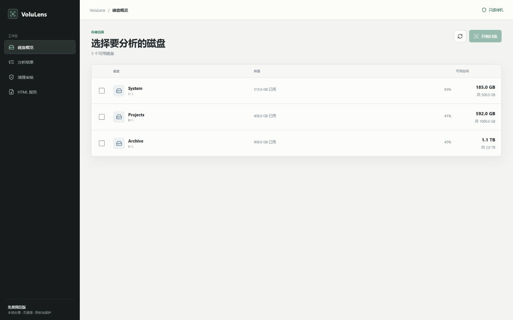
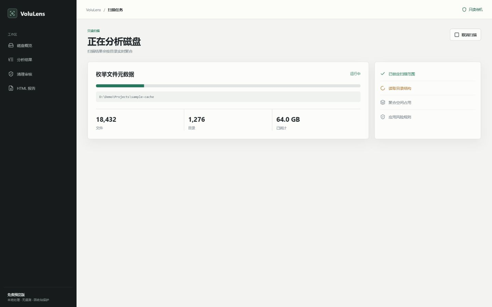
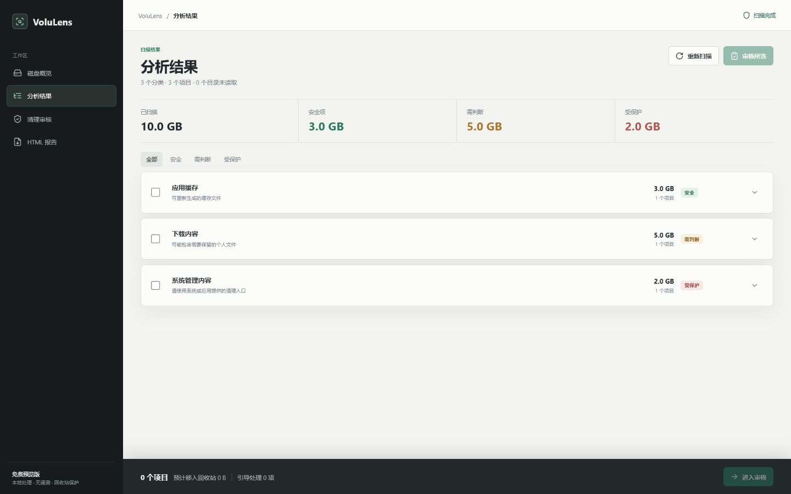
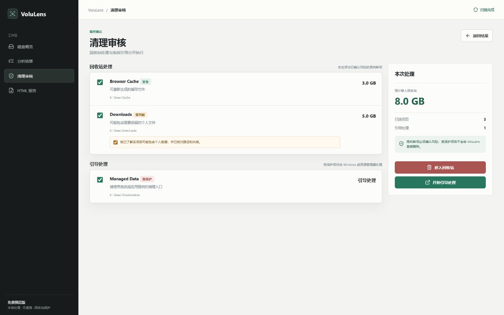

# VoluLens

VoluLens 是一个面向 Windows 10/11 的本地磁盘空间分析工具。它在用户主动选择磁盘后执行只读扫描，按目录聚合占用，并将结果区分为安全、需判断和受保护三类。

VoluLens is a privacy-focused local disk usage analyzer for Windows 10 and Windows 11.

## 界面预览









更多截图和隐私拍摄规则见 [docs/screenshots/README.md](docs/screenshots/README.md)，其中包含只读 HTML 报告预览。

## 功能

- 列出本机可用磁盘和容量，默认不自动扫描。
- 只读、可取消的目录扫描；跳过重解析点，避免目录链接循环。
- 识别临时文件、常见缓存、个人数据和 Windows 受保护路径。
- 安全项目可移入回收站；需判断项目需要在审核页确认；受保护项目只提供系统引导处理。
- 导出自包含、可脱敏、没有原生桥接能力的只读 HTML 报告。
- WPF + WebView2 离线界面，不加载远程资源，不包含遥测。

## 安全与隐私

扫描阶段只读取文件系统元数据，不读取文件内容、不修改权限，也不请求管理员提权。目录在扫描时无权限、路径过长或发生变化时，可能不计入结果。

清理操作不会永久删除文件。应用只允许当前扫描中、经过路径校验的项目移入 Windows 回收站；用户数据需要额外确认；受保护内容不会提供直接删除入口。

导出的 HTML 报告不包含 `window.chrome.webview` 桥接，也不能执行清理操作。报告中的用户目录可以脱敏。

## 下载和运行

前往本仓库的 **Releases** 页面下载 `VoluLens-win-x64.zip`，解压后运行 `VoluLens.App.exe`。

运行环境：

- Windows 10 1903 或更高版本，或 Windows 11。
- Microsoft Edge WebView2 Evergreen Runtime。

程序包包含 .NET 8 运行时，但不包含 WebView2 Runtime。

## 从源码构建

在仓库根目录运行：

```powershell
powershell -NoProfile -ExecutionPolicy Bypass -File .\scripts\install-dotnet.ps1
powershell -NoProfile -ExecutionPolicy Bypass -File .\scripts\dotnet.ps1 restore VoluLens.sln
powershell -NoProfile -ExecutionPolicy Bypass -File .\scripts\dotnet.ps1 test VoluLens.sln -c Release
```

发布 win-x64 自包含版本：

```powershell
powershell -NoProfile -ExecutionPolicy Bypass -File .\scripts\publish-win-x64.ps1
```

发布文件输出到 `artifacts\publish\win-x64\VoluLens.App.exe`。在上传 GitHub Release 前，请按 [RELEASE_GUIDE.md](RELEASE_GUIDE.md) 创建精简 ZIP，不要提交 `artifacts/` 或 `WebView2Data/`。

## 项目结构

```text
src/VoluLens.Core/     扫描、分类、路径安全与 HTML 报告逻辑
src/VoluLens.App/      WPF 宿主、WebView2 界面和 Windows 服务
tests/                 Core 与 App 的 xUnit 测试
scripts/               本地 SDK、构建和发布脚本
docs/screenshots/      公开演示截图与拍摄规范
```

## 贡献

欢迎提交 Issue 和 Pull Request。贡献流程与安全约束见 [CONTRIBUTING.md](CONTRIBUTING.md)。

## 第三方组件

界面使用 Lucide 图标，版本为 `0.468.0`，采用 MIT License。许可证副本位于 `src/VoluLens.App/Assets/LUCIDE-LICENSE.txt`。

## License

本项目采用 [MIT License](LICENSE)。
